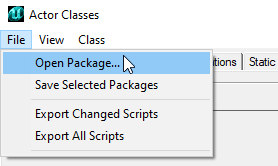
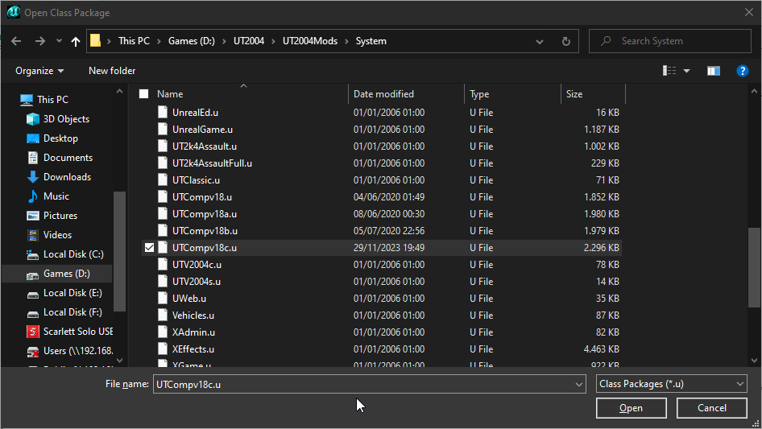
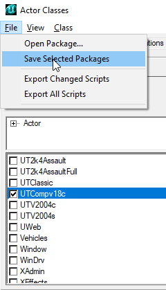

# UTComp

## Installation

## Client Settings

## Server Settings

## Building

1. Clone this repository into a subfolder of the root directory of UT2004. Make sure the name of that subfolder is the name of the version of UTComp that you want to build.
2. Copy MiniSuperHealth.usx and minimegatex.utx to the StaticMeshes and Textures folders, respectively, in your UT2004 directory.
3. Execute build.bat

### Example

```
cd /D C:\UT2004\
git clone https://github.com/Deaod/UTComp UTCompv18c
cd UTCompv18c
build.bat
```

### Release Builds

For releases the following steps need to be done in addition:

#### Step 1 - Load Release Package



#### Step 2 - Select Release Package



#### Step 3 - Select MiniSuperHealth Static Mesh

![Step 3 - Open Static Mesh Browser, Select Release Package, Select MiniSuperHealth Mesh, Open Materials[0] Property](Docs/Release_Step_3.png)

#### Step 4 - Change MiniSuperHealth Material

![Step 4 - Select Property Materials[0].Material, Replace FinalBlend'minimegatex.minimegatex' with FinalBlend'[Release Package].minimegatex'](Docs/Release_Step_4.png)

#### Step 5 - Save Release Package



